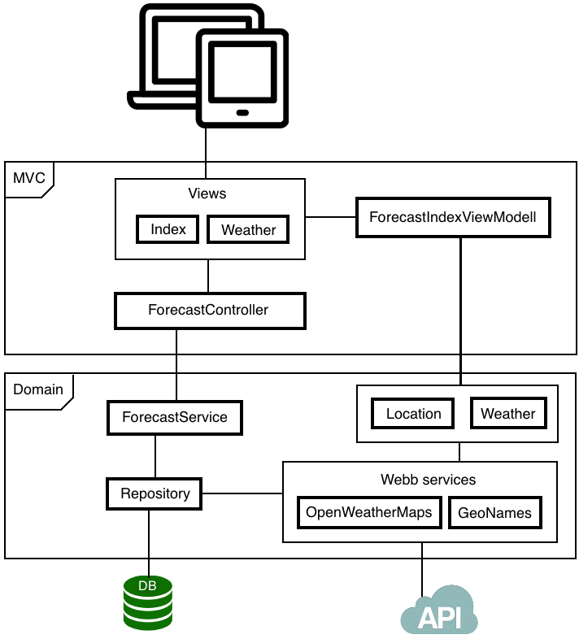

Länk till applikationen http://vhost9.lnu.se:20081/1dv409/rn222cx

### Inledning

Projektet är en väderapplikation som kan söka upp väderprognoser i hela världen med hjälp av API:erna från GeoNames.com samt openWeatherMap.com.
Applikationen fungerar på så sätt att användaren söker på en plats och får upp matchande platser i en lista. Vid val av plats/ort kommer en sida att visa en femdygnsprognos över den valda lokaliteten.

### Teknik

* Applikationen bygger på ramverket ASP.NET MVC 5 med C# som programmeringsspråk. 
* Databasen är av typen MSSQL och hanteras med ramverket Entity Framework.
* Ramverket Razor används i vyerna för att enklare kunna arbeta gentemot modellen.
* Bootstrap används för att få en responsiv applikation samt en del CSS klasser.
* jQuery används till validering samt viss offline funktionalitet.

### Schematisk bild

### Säkerhet

Applikationen bygger på ASP.NET som har inbyggt skydd mot skadlig indata vilket förhindrar XSS-attacker, även ramverket Razor som används i vyerna har skydd mot indata. 
Databasen använder ramverket Entity Framework och frågespråket LINQ som ger skydd för SQL-injections.
Hjälpmetoden AntiForgeryToken som ger skydd mot CRSF attacker är utkommenterad då token value dessvärre cachas med appcache.
Jag ser dock inte detta som en säkerhetsrisk då applikationen inte är sårbar mor CSRF attacker.
All databas kommunikation sker genom användaren Appuser som har särskilda rättigheter.

### Prestandaoptimering

All CSS och JavaScript/jQuery bibliotek är av minimerad version. Alla CSS filer ligger i header sektionen och JavaScript filerna ligger sist i body sektionen. Applikationen använder appcache för att cacha allt statisk på sidorna som ger en snabbare sidladdning.
All data som hämtas från GeoNames lagras i databasen för att minska belastningen hos GeoNames samt ger en mer optimerad applikation.
All väderdata hämtas från openWeatherMap och lagras i databasen i minst 10 minuter då det är både ett krav från openWeatherMaps och för optimeringen.

### Offline-first

Applikationen använder sig av appcache som cachar allt statiskt på sidan, det vill säga att de sidor som användaren har besökt innan kan denne besöka offline. Sidan som visar väderprognosen sparar url'en i localstorage och när användaren blir offline kommer en lista med sökta platser visas som hämtas från localstorage.
Med hjälp av jQuery pluginet Checknet som pingar applikationen med jämna mellanrum kan applikationen känna av om man har någon kontakt med sidan. Scriptet pingar filen ping.html med ett intervall på 5 sekunder för att se om det finns någon kontakt. Vid offline kommer applikationen att visa detta och sidan får en minskad funktionalitet.

### Risker med din applikation

Applikationen förlitar sig helt på att API:ernas struktur och användningsvillkor förblir oförändrade.
